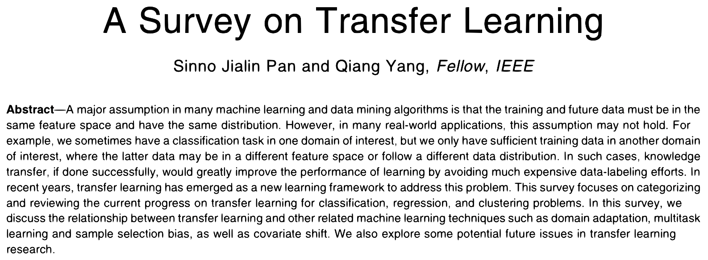

# Transfer learning
#### &#127829; + ML

###  <small> Basil Kraft | bkraft@bgc-jena.mpg.de | &#127829; + ML | October 2020 </small>

<table>
  <tr>
    <td style="text-align:right">
        Global Diagnostic Modelling Group 
        Department of Biogeochemical Integration 
        Max Planck Institute for Biogeochemistry
    </td>
    <td style="text-align:right; height:59px; width:59px"></td>
    <td style="text-align:right; height:59px"></td>
    <td style="text-align:left">
        Computer Vision Research Group 
        Department of Aerospace and Geodesy 
        Technical University of Munich
    </td>
  </tr>
</table>

<!---
Select theme:
* Black
* White
* League
* Sky
* Beige
* Simple
* Serif
* Blood
* Night
* Moon
* Solarized
-->

--

<figure>
  
  <figcaption>Pan, S. J., & Yang, Q. (2009). A survey on transfer learning. IEEE Transactions on knowledge and data engineering , 22 (10), 1345-1359. 4.</figcaption>
</figure>

--

<!---

Figures with caption
------------------------------------------

<figure>
  <figure>
    
    <figcaption>Source 1</figcaption>
  </figure>
  <figure>
    
    <figcaption>Source 2</figcaption>
  </figure>
</figure>

Backup slides
------------------------------------------
Put this at each backup slide end:

<section id="appendix" class="stack"></section>

Left / right alignment
------------------------------------------

- You can place two graphs on a slide
- Or two columns of text
- These are all created with div elements

-->